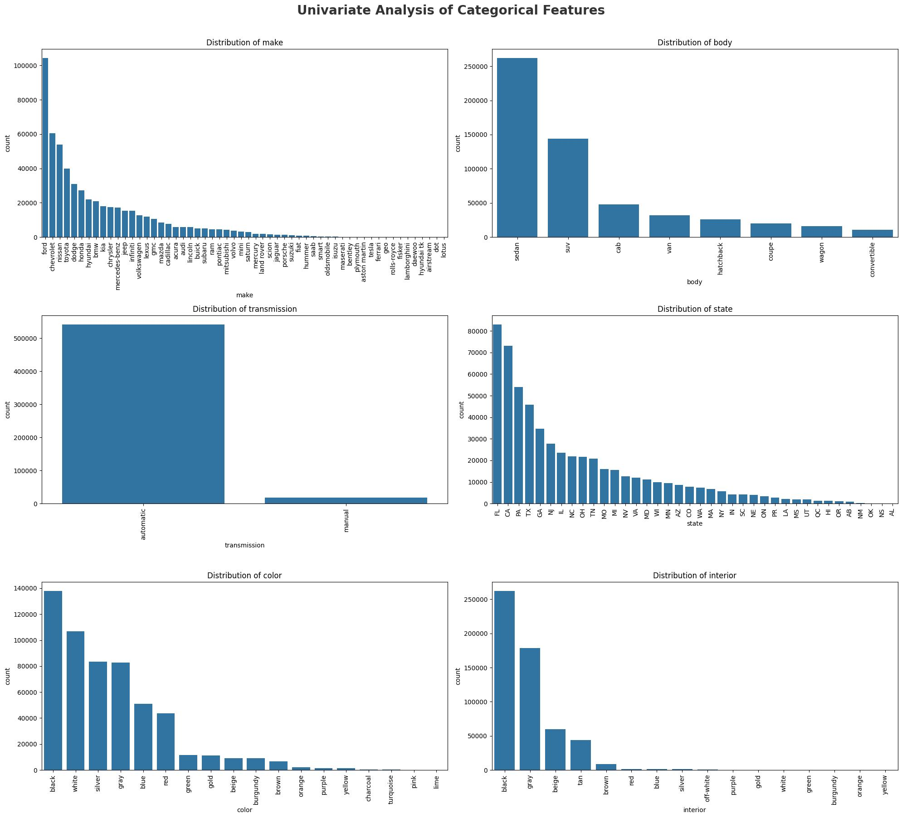
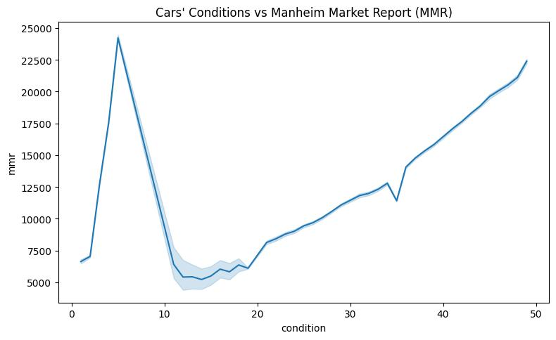

# Car-Sales-and-Market-Trends
This project combines **exploratory data analysis (EDA)** and **machine learning modeling** to understand the used car market and predict car selling prices.

## Objectives
1. Perform data cleaning and preprocessing  
2. Explore key insights (trends, correlations, distributions)  
3. Build predictive models (Linear Regression)  
4. Evaluate model performance  

## Dataset
- Source: [Kaggle - Vehicle Sales Data](https://www.kaggle.com/datasets/syedanwarafridi/vehicle-sales-data)  
- Size: 500,000+ records  
- Features: year, brand, model, trim, body, transmission, state, condition, odometer, color, interior, seller, mmr, selling price, saledate.  

## Tools
- Python (pandas, numpy, matplotlib, seaborn, plotly, scikit-learn)  
- Jupyter Notebook  
- Tableau (for dashboard visualization)  

## Exploratory Data Analysis (EDA)
- Univariate Analysis of Numerical Feature
  ```python
  num_columns=df.select_dtypes(include=np.number).columns.to_list()
  plt.figure(figsize=(14,10))
  plt.suptitle("Univariate Analysis of Numerical Features",fontsize=20,fontweight='bold',alpha=0.8,y=1.)
  for i, col in enumerate (num_columns):
    plt.subplot(3,2,i+1)
    sns.histplot(df[col], bins=30, kde=True)
    plt.title(f"Distribution of {col}")
  plt.tight_layout(rect=[0, 0, 1, 0.99])
  plt.savefig("01_Univariate_Analysis_of_ Numerical_Features.jpg", bbox_inches='tight')
  plt.show()
  ```

- Univariate Analysis of Categorical Feature
  ```python
  cat_columns=['make','body', 'transmission','state', 'color', 'interior']
  plt.figure(figsize=(20,18))
  plt.suptitle("Univariate Analysis of Categorical Features",fontsize=20,fontweight='bold',alpha=0.8,y=1.)
  for i, col in enumerate (cat_columns):
    plt.subplot(3,2,i+1)
    sns.countplot(x=df[col], order=df[col].value_counts().index)
    plt.xticks(rotation=90)
    plt.title(f"Distribution of {col}")
  plt.tight_layout(rect=[0, 0, 1, 0.99])
  plt.savefig("02_Univariate_Analysis_of_Categorical_Features.jpg", bbox_inches='tight')
  plt.show()
  ```
  
- Multivariate Analysis (Correlation of Numerical Features)
  ```python
  plt.figure(figsize=(8,5))
  sns.heatmap(df.corr(numeric_only=True), annot=True, cmap="crest")
  plt.title("Multivariate Analysis (Correlation of Numerical Features)")
  plt.savefig("03_Multivariate_Analysis_(Correlation_of_Numerical_Features).jpg", bbox_inches='tight')
  plt.show()
  ```
  .jpg)
- Distribution of car prices
  ```python
  if 'make' in df.columns:
    plt.figure(figsize=(14,7))
    sns.boxplot(x='make', y='sellingprice', data=df, palette='flare')
    plt.xticks(rotation=90)
    plt.title("Brand vs Selling Price")
    plt.tight_layout(rect=[0, 0, 1, 0.99])
    plt.savefig("04_Brand_vs_Selling_Price_(boxplot).jpg", bbox_inches='tight')
    plt.show()
  ```
  .jpg)
- Relationship between odometer and price
  ```python
  if 'odometer' in df.columns:
    plt.figure(figsize=(8,5))
    sns.scatterplot(x='odometer', y='sellingprice', data=df, hue='body', palette='magma')
    plt.title("Odometer vs Selling Price")
    plt.tight_layout(rect=[0, 0, 1, 0.99])
    plt.savefig("05_Odometer_vs_Selling_Price_(scatterplot).jpg", bbox_inches='tight')
    plt.show()
  ```
  .jpg)
- Effect of condition and MMR
  ```python
  if 'condition' in df.columns:
    plt.figure(figsize=(8,5))
    sns.lineplot(x='condition', y='mmr', data=df)
    plt.title("Cars' Conditions vs Manheim Market Report (MMR)")
    plt.tight_layout(rect=[0, 0, 1, 0.99])
    plt.savefig("06_Condition_vs_MMR.jpg", bbox_inches='tight')
    plt.show()
  ```
  

## Visualization
- Trends of Monthly Sales Revenue (Top 10 Brands)
  ```python
  #Parsing datetime
  df['date'] = pd.to_datetime(df['saledate'], errors="coerce").dt.tz_convert(None)
  
  #Group by saledate (monthly) and brand, then sum selling price
  group = df.groupby([
    df['date'].dt.to_period('M').dt.to_timestamp(),  # group by month
    'make'
  ])['sellingprice'].sum().reset_index()

  # Top 10 brands by total selling price
  top_brand = (
    group.groupby('make')['sellingprice']
    .sum()
    .sort_values(ascending=False)
    .head(10)
    .index
  )
  
  # Filter grouped data to only include those brands
  top_group = group[group['make'].isin(top_brand)]
  
  # Convert sales to millions
  top_group.loc[:, 'Sales (Million)'] = top_group['sellingprice'] / 1e6
  
  # Plot
  plt.figure(figsize=(12, 6))
  sns.lineplot(data=top_group, x='date', y='Sales (Million)', hue='make', marker=(8,0,0))
  plt.title('Monthly Sales Revenue (Top 10 Brands)', fontsize=20)
  plt.xlabel('Sale Date')
  plt.ylabel('Sales (Million, $)')
  ax = plt.gca()
  ax.xaxis.set_major_locator(mdates.MonthLocator(interval=1))  # every 1 month
  ax.xaxis.set_major_formatter(mdates.DateFormatter('%b %Y'))  # format as Jan 2015
  plt.xticks(rotation=45)
  plt.legend(title='Brand', bbox_to_anchor=(1.05, 1), loc='upper left')
  plt.tight_layout(rect=[0, 0, 1, 0.99])
  plt.grid(True)
  plt.savefig("07_Monthly_Sales_Revenue_(Top_10_Brands).jpg", bbox_inches='tight')
  plt.show()
  ```
  .jpg)
- Top 10 Most Popular Cars (Brand-Model)
  ```python
  top_model = (df['make'] + ' - ' + df['model']).value_counts().head(10).reset_index()
  top_model.columns = ['BrandModel', 'Quantity']
  
  max_val = top_model['Quantity'].max()
  
  fig = px.bar(
    top_model,
    x='BrandModel',
    y='Quantity',
    title='Top 10 Most Popular Cars (Brand-Model)',
    text='Quantity'
  )
  
  fig.update_traces(textposition='outside')
  
  fig.update_layout(
    yaxis=dict(range=[0, max_val * 1.2]),
    xaxis_tickangle=-45
  )
  
  fig.show()
  fig.write_html("08_Top_10_Most_Popular_Cars.html")
  ```
  
- Top 10 Cars by Total Sales Revenue
  ```python
  df['BrandModel'] = df['make'] + ' - ' + df['model']
  
  # Group by BrandModel and sum the selling price
  top_model_revenue = (
    df.groupby('BrandModel')['sellingprice']
    .sum()
    .sort_values(ascending=False)
    .head(10)
    .reset_index()
  )
  top_model_revenue['TotalRevenueMillions$'] = (top_model_revenue['sellingprice'] / 1e6).round(2)
  
  # Get max revenue value to set y-axis limit
  max_val = top_model_revenue['TotalRevenueMillions$'].max()
  
  # Create the bar chart
  fig = px.bar(
    top_model_revenue,
    x='BrandModel',
    y='TotalRevenueMillions$',
    title='Top 10 Cars by Total Sales Revenue (in Millions)',
    text='TotalRevenueMillions$'
  )
  
  fig.update_traces(textposition='outside')
  
  fig.update_layout(
    yaxis=dict(range=[0, max_val * 1.2]),  # 20% headroom
    yaxis_title='Revenue (Millions $)',
    xaxis_tickangle=-45,
    xaxis=dict(categoryorder='total descending')
  )
  
  fig.show()
  fig.write_html("09_Top_10_Cars_by_Total_Sales_Revenue.html")
  ```
  
- Treemap of top cars models by total revenue
  ```python
  model_revenue = (
    df.groupby(['make', 'model'])['sellingprice']
    .sum()
    .reset_index()
    .sort_values(by='sellingprice', ascending=False)
  )
  
  fig = px.treemap(
    model_revenue.head(50),  # Limit to top 50 for clarity
    path=['make', 'model'],
    values='sellingprice',
    title='Top Cars Models by Total Revenue'
  )
  fig.show()
  fig.write_html("10_Top_ Cars_Models_by_Total_Revenue_(treemap).html")
  ```
  .html)
- Scatterplot of Car Selling Price vs Manufacturing Year by Brand
  ```python
  fig = px.scatter(
    df,
    x='year',
    y='sellingprice',
    color='make',  
    title='Car Selling Price vs Manufacturing Year by Brand',
    opacity=0.6,
    height=600
  )
  
  fig.update_layout(
    xaxis=dict(dtick=1),
    yaxis_title='Selling Price ($)',
    xaxis_title='Year',
    legend_title='Brand',
    margin=dict(l=60, r=20, t=60, b=60)
  )
  
  fig.show()
  fig.write_html("11_Cars_Selling_Price_vs_Manufacturing_Year_by_Brand_(scatter).html")
  ```
  .html)
- Heatmap Total Sales Revenue by State
  ```python
  state_revenue = df.groupby('state')['sellingprice'].sum().reset_index()
  
  fig = px.choropleth(
    state_revenue,
    locations='state',
    locationmode="USA-states",
    color='sellingprice',
    color_continuous_scale="cividis",
    scope="usa",
    title="Total Sales Revenue by State"
  )
  fig.show()
  fig.write_html("12_Total_Sales_Revenue_by_State.html")
  ```
  
## Modeling
- Linear Regression  
- Metrics: MAE, RMSE, R²
  ```python
  #target
  y = df['sellingprice']
  
  #predictor features
  X = df[['year', 'condition', 'odometer', 'mmr']]
  
  #split: train and test
  X_train, X_test, y_train, y_test = train_test_split(
    X, y, test_size=0.2, random_state=42
  )
  
  #Linear Regression
  linreg = LinearRegression()
  linreg.fit(X_train, y_train)
  
  #prediction
  y_pred = linreg.predict(X_test)
  
  #evaluation
  mae = mean_absolute_error(y_test, y_pred)
  rmse = np.sqrt(mean_squared_error(y_test, y_pred))
  r2 = r2_score(y_test, y_pred)
  
  print("=== Linear Regression ===")
  print("MAE:", mae)
  print("RMSE:", rmse)
  print("R² Score:", r2)
  
  #coef feature
  coef = pd.DataFrame({
    'Feature': X.columns,
    'Coefficient': linreg.coef_
  }).sort_values(by='Coefficient', ascending=False)
  print("\nCoefficient Linear Regression:")
  print(coef)
  
  print("Intercept:", linreg.intercept_)
  
  #Save model
  joblib.dump(linreg, "linear_regression_model_car.pkl")
  
  #Load model
  loaded_model = joblib.load("linear_regression_model_car.pkl")
  ```
  
## Results
- Key insights: Car prices are mainly influenced by condition and MMR.  

## Dashboard
👉 Tableau Dashboard: [View Here](https://public.tableau.com/...)  
